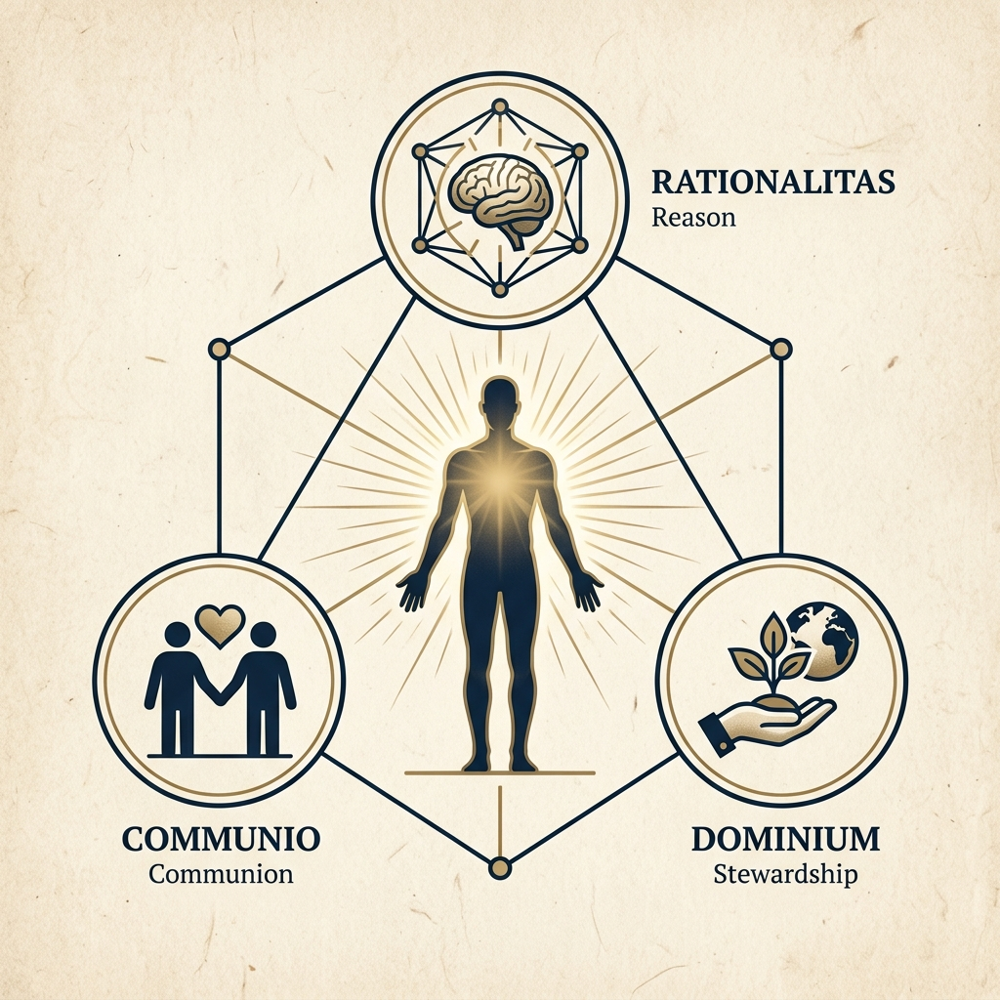

# Phẩm Giá Con Người Theo Quan Điểm Kitô Giáo. ✠



## 📖 Tổng Quan Dự Án
Đây là một nền tảng báo cáo nghiên cứu chuyên sâu (Scholarly Research Report) về chủ đề **Phẩm Giá Con Người (Imago Dei)** dưới lăng kính thần học Kitô giáo. Dự án được thiết kế với tiêu chuẩn thẩm mỹ học thuật giáo hội, kết hợp với các công cụ công nghệ tiên tiến nhất để tối ưu hóa trải nghiệm đọc và nghiên cứu lâu dài.

Báo cáo đối chiếu sâu sắc giữa ba truyền thống lớn: **Công giáo**, **Chính thống giáo** và **Tin Lành**, đồng thời phân tích các thách thức đương đại như Trí tuệ Nhân tạo (AI), Đạo đức sinh học và bối cảnh dấn thân tại Việt Nam.

---

## ✨ Tính Năng Nổi Bật

### 🏛️ Trải Nghiệm Đọc Học Thuật (Scholarly UX)
- **Hệ thống Typographic Cao cấp:** Sử dụng cặp phông chữ chuyên dụng `Crimson Pro` (Body) và `Montserrat` (Heading) tạo cảm giác như đọc một ấn bản chuyên san in giấy.
- **Chế độ đọc đa dạng:** Hỗ trợ đầy đủ **Light Mode**, **Dark Mode** và đặc biệt là **Sepia Mode** (Màu giấy cũ) giúp giảm mỏi mắt khi nghiên cứu lâu.
- **Thanh tiến trình đọc (Reading Progress):** Theo dõi độ sâu của bài đọc theo thời gian thực.
- **Trích dẫn thông minh (Smart Citations):** Tự động nhận diện và hiển thị chú thích (tooltips) khi di chuột qua các số trích dẫn.

### 🔍 Công Cụ Nghiên Cứu Mạnh Mẽ
- **Tìm kiếm mờ (Fuzzy Full-text Search):** Tích hợp `Fuse.js` cho phép tìm kiếm chính xác các thuật ngữ thần học chuyên sâu (ví dụ: *Theosis*, *Subsidiarity*, *Imago Dei*) ngay trên trình duyệt thông qua phím tắt `Ctrl + K`.
- **Đánh dấu trực tiếp (Live Highlighting):** Từ khóa tìm kiếm sẽ được tự động tô sáng trong văn bản chính để người đọc dễ dàng định vị.
- **Mục lục linh hoạt (Floating TOC):** Điều hướng nhanh giữa 7 chương và hàng chục tiểu mục.

### 📈 Tối Ưu Hóa SEO & Chia Sẻ
- **Dữ liệu cấu trúc JSON-LD:** Đã cấu hình chuẩn `ScholarlyArticle` của Schema.org để Google nhận diện đây là một công trình nghiên cứu chính thống.
- **OpenGraph & Twitter Cards:** Hiển thị sơ đồ thần học chuyên nghiệp khi chia sẻ trên mạng xã hội.
- **Sitemap & Robots.txt:** Đầy đủ các tệp hỗ trợ lập chỉ mục SEO.

---

## 🛠️ Công Nghệ Sử Dụng
Dự án được xây dựng trên nền tảng kỹ thuật hiện đại nhất:
- **Framework:** Next.js 16 (App Router)
- **Styling:** Tailwind CSS v4 (Hệ thống màu sắc và biến CSS mới nhất)
- **Search Engine:** Fuse.js
- **UI Components:** Shadcn/UI & Lucide React
- **Typography:** Google Fonts (Crimson Pro, Montserrat, Playfair Display)

---

## 🚀 Hướng Dẫn Cài Đặt

### 1. Nhân bản dự án
```bash
git clone https://github.com/yourusername/pham-gia-con-nguoi.git
cd pham-gia-con-nguoi
```

### 2. Cài đặt dependencies
```bash
npm install
```

### 3. Chạy môi trường phát triển
```bash
npm run dev
```

### 4. Xây dựng bản sản xuất (Static Export)
```bash
npm run build
```

---

## 🖋️ Quyền Tác Giả & Bản Quyền
Dự án được xây dựng với ♥ dành cho Sự Thật và Phẩm Giá.
© 2026 · **Nghiên Cứu Chuyên Sâu**.

*"Con người là một huyền nhiệm thiêng liêng được đan dệt bởi tình yêu thần linh."*
